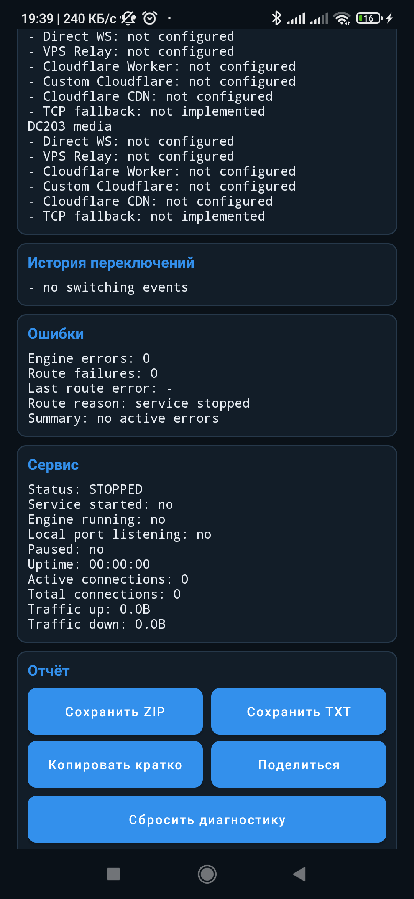

# Диагностика

Диагностика показывает текущее состояние сети, профиля, маршрута, сервиса и последних ошибок.
Отчет нужен, чтобы отправить проблему разработчику без ADB и без ручного сбора логов.

## Где открыть

В приложении:

```text
Главный экран -> Диагностика
```

или:

```text
Настройки -> Система -> Диагностика и логи -> Открыть диагностику
```

<table>
  <tr>
    <td align="center"><br><sub>TXT, ZIP, копирование и сброс</sub></td>
  </tr>
</table>

## Блоки экрана

```text
Текущая сеть
Активный профиль
Активный маршрут
Проверка маршрутов
История переключений
Ошибки
Сервис
Отчет
```

`Проверка маршрутов` показывает кандидаты Direct WS, VPS Relay, Cloudflare Worker,
пользовательский Cloudflare-домен и публичный Cloudflare. Отдельный TCP preflight в отчёте не
является runtime-маршрутом и не заменяет MTProto end-to-end probe.

Relay `/test-routes` всегда подписан `TCP_ONLY`: он доказывает только TCP-доступность endpoint с
VPS. Финальный PASS ставится Android только после собственного `req_pq/resPQ`. Проверка
`Отклик MTProto` открывает отдельное соединение и проверяет настоящий `req_pq/resPQ`. До первого
подключения Telegram приложение строит пробу из активного профиля и доступных маршрутов; после
появления реального маршрута проверяется уже его фактический endpoint. Поэтому проверка не
зависит от того, добавлен ли локальный прокси в Telegram и создаёт ли Telegram сейчас трафик.

Главный статус разделяет локальную готовность и реальный трафик: `Ожидание Telegram` означает,
что локальный listener работает и ждёт клиента; `Подключение к Telegram` — клиент уже открыл
socket, но маршрут ещё проверяется; `Активен` — есть свежий подтверждённый маршрут. Отсутствие
трафика Telegram больше не показывается как поломка приложения.

`История переключений` берется из кольцевого лога приложения. В нем видны смены профиля,
перезапуски сервиса, ошибки маршрута и действия диагностики.

## Кнопки отчета

`Сохранить ZIP`
: сохраняет полный архив диагностики.

`Сохранить TXT`
: сохраняет текстовый отчет.

`Копировать кратко`
: копирует короткое резюме для чата.

`Поделиться`
: открывает системное меню отправки отчета.

`Сбросить диагностику`
: очищает текущую историю событий и перерисовывает экран. Используйте перед повторной проверкой,
если нужно получить отчет с нуля.

## Что делать перед отправкой отчета

1. Нажмите `Сбросить диагностику`, если нужна чистая проверка.
2. Включите прокси.
3. Откройте Telegram и воспроизведите проблему.
4. Вернитесь в TG Proxy.
5. Откройте `Диагностика`.
6. Нажмите `Сохранить ZIP` для issue или `Сохранить TXT` для локального просмотра.

Для проблем фоновой работы, профилей, переключения Relay и загрузки media всегда выбирайте ZIP:
краткая копия и скриншот не содержат всей истории событий.

## Что попадает в отчет

- версия приложения;
- versionCode;
- производитель и модель устройства;
- версия Android;
- активная сеть и профиль;
- активный маршрут;
- route checks по DC;
- последние ошибки;
- состояние foreground service;
- локальный endpoint;
- настройки маршрутизации;
- VPS Relay без raw token;
- Cloudflare/Worker домены;
- аптайм;
- счетчики трафика;
- последние события DiagnosticsLog.

## Что маскируется

Отчет не должен содержать:

```text
SSH password
private key
raw VPS Relay token
полный MTProto secret
```

MTProto secret и Relay token показываются только в сокращенном виде.

## Как читать типовые ошибки

`timeout`
: сеть не ответила вовремя.

`DNS failed`
: домен не разрешился.

`TLS failed`
: ошибка TLS handshake.

`HTTP 429`
: Cloudflare ограничил маршрут.

`WS handshake failed`
: сервер ответил не `101 Switching Protocols`.

`service killed`
: Android остановил сервис или приложение потеряло foreground-состояние.

## Когда использовать ZIP

TXT хватает для большинства проблем. ZIP нужен, если:

- плавает профиль сети;
- VPS Relay то работает, то пропадает;
- приложение само останавливает прокси;
- нужно сравнить настройки, route checks и последние события.

Прикрепите ZIP к подходящей форме из [Issues](https://github.com/Dushnyj/TG-Proxy/issues/new/choose).
Перед отправкой просмотрите архив: автоматическое маскирование не отменяет проверку владельцем.

## Проверка после изменения настроек

После смены DC mapping, Cloudflare-домена, Worker или VPS Relay:

1. Сбросьте диагностику.
2. Нажмите `Тест` в соответствующем блоке настроек.
3. Запустите прокси.
4. Подождите 10-20 секунд.
5. Сохраните TXT.

Так в отчете останутся только события новой проверки.
