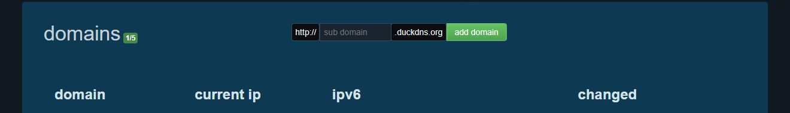

# Бесплатный адрес DuckDNS для VPS Relay

DuckDNS выдаёт бесплатное имя вида `my-relay.duckdns.org`. TG Proxy может самостоятельно
направить это имя на публичный IP вашего VPS, установить HTTPS-сертификат и настроить его
продление.

Покупать домен для VPS Relay не требуется.

## Что потребуется

- уже купленный Linux VPS с публичным IP и SSH-доступом;
- учётная запись на [duckdns.org](https://www.duckdns.org/);
- свободное имя DuckDNS;
- TG Proxy Android.

## 1. Создать имя

1. Откройте [duckdns.org](https://www.duckdns.org/) и войдите одним из предложенных способов.
2. Найдите блок **domains**.
3. В поле `sub domain` введите только свободную часть имени, например `my-tg-relay`.
4. Нажмите **add domain**.

  

После сообщения `success` в списке появится полный адрес вида
`my-tg-relay.duckdns.org`. Не публикуйте скриншот всей страницы: в верхней части DuckDNS
показывает адрес аккаунта и приватный token.

## 2. Передать данные приложению

1. В TG Proxy откройте **Настройки → Relay → Автонастройка VPS**.
2. Введите SSH host/IP, порт, пользователя и пароль от VPS.
3. После read-only проверки выберите **Бесплатный адрес DuckDNS**.
4. Введите полный адрес `my-tg-relay.duckdns.org`.
5. Скопируйте token из личной страницы DuckDNS и вставьте его в поле **Токен DuckDNS**.
6. Нажмите **Проверить адрес**.

TG Proxy вызовет официальный HTTPS endpoint DuckDNS, передаст ему имя, token и публичный IP
проверенного VPS, затем дождётся обновления DNS. Вручную заполнять поле `current ip` на сайте не
нужно.

## 3. Проверить план

На следующем шаге приложение обязано показать понятный план до изменений:

- найденный Linux, архитектуру, init-систему и пакетный менеджер;
- совпадение DNS с публичным IP VPS;
- будет ли установлен или обновлён Relay;
- будет ли добавлен отдельный HTTPS-маршрут;
- какие проверки выполнятся после установки.

Если DNS ещё не обновился, мастер ждёт несколько попыток. При окончательной ошибке сервер не
изменяется.

## 4. Что приложение сделает само

- скачает подходящий официальный Relay asset и проверит SHA-256;
- создаст конфигурацию и отдельные client/owner credentials;
- установит службу автозапуска;
- установит nginx и Certbot, если это безопасно и необходимо;
- выпустит бесплатный сертификат Let's Encrypt;
- настроит автоматическое продление;
- проверит HTTPS, client token, regular и media-маршруты Telegram;
- сохранит owner-доступ в защищённом хранилище Android.

## Безопасность token DuckDNS

- token даёт право менять DNS всех имён этого DuckDNS-аккаунта;
- не отправляйте его получателям Relay и не добавляйте в issue;
- TG Proxy хранит его только в защищённом локальном хранилище;
- ссылка/QR подключения, обычный экспорт и диагностика не должны содержать этот token;
- при подозрении на утечку обновите token в DuckDNS и повторите настройку.

## Частые ошибки

`Адрес занят`
: выберите другое уникальное имя.

`DuckDNS не принял обновление`
: проверьте полный адрес и token; не добавляйте `https://` и путь.

`DNS указывает не на этот VPS`
: дождитесь распространения DNS и повторите проверку. Не запускайте установку для адреса,
которым вы не управляете.

`Порт 80 недоступен`
: HTTP-01 проверка сертификата требует входящий TCP 80. Проверьте firewall VPS и панель
хостинга.

`HTTPS не выпущен`
: сохраните полный диагностический ZIP и откройте issue по [SUPPORT.md](../SUPPORT.md), не
прикладывая DuckDNS token и SSH-пароль.
