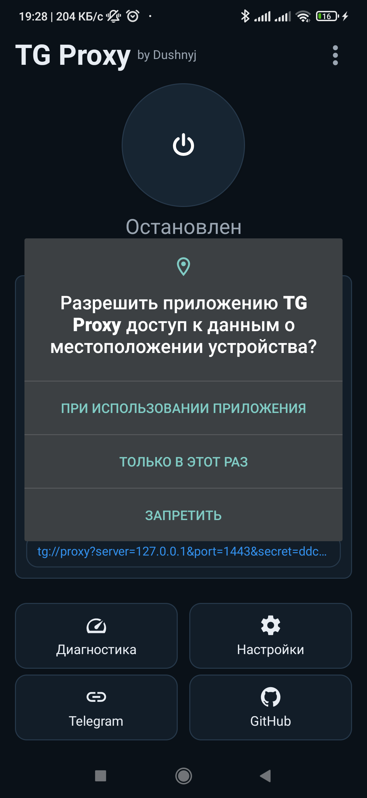
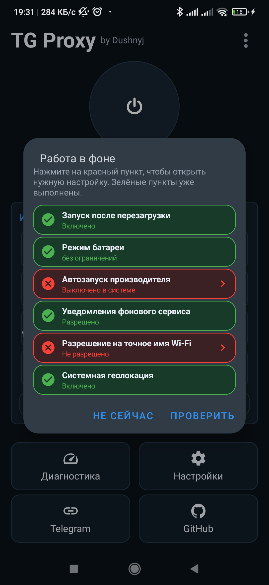
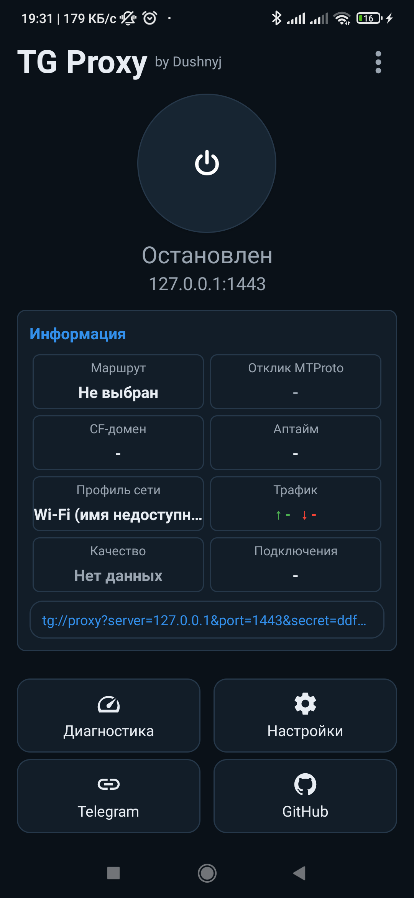

# Быстрый старт TG Proxy

Эта инструкция ведёт от установки APK до первого рабочего подключения Telegram. Для обычной
настройки не нужны ADB, root-доступ или ручное редактирование файлов.

## Что потребуется

- телефон или планшет с Android 5.0+;
- Telegram для Android;
- доступ в интернет;
- APK из официального раздела [Releases](https://github.com/Dushnyj/TG-Proxy/releases).

VPS, домен и Cloudflare не обязательны для первого запуска. Их можно добавить позже как
резервные маршруты.

## 1. Установить APK

1. Откройте последний релиз.
2. Для неизвестного устройства скачайте
   `TG-Proxy-v<version>-android-universal-release.apk`.
3. При желании сравните SHA-256 файла с `SHA256SUMS.txt`:

   ```powershell
   Get-FileHash .\TG-Proxy-v1.2.0-android-universal-release.apk -Algorithm SHA256
   ```

4. Разрешите установку приложений из этого источника и установите APK.

Обновление APK с той же подписью устанавливается поверх приложения и сохраняет настройки.
Android не позволит установить поверх него сборку с другой подписью.

## 2. Выдать системные разрешения

При первом запуске приложение запрашивает уведомления foreground service. Разрешение нужно,
чтобы Android показывал работающий прокси и не считал его невидимым фоновым процессом.

<p align="center">
  
</p>

Откройте помощник **Непрерывная работа прокси** и проверьте все пункты:

- запуск после перезагрузки;
- режим батареи **Без ограничений**;
- автозапуск производителя, если он есть в прошивке;
- уведомления фонового сервиса;
- разрешение на точное имя Wi-Fi;
- включённая системная геолокация для чтения SSID на новых Android.

Каждая плашка показывает зелёную галочку или красный крест. Нажатие на проблемную плашку
открывает нужный системный экран. Некоторые оболочки не предоставляют Android достоверный API
автозапуска; в таком случае приложение просит подтвердить этот пункт вручную.

<p align="center">
  
</p>

Постоянно включённый экран не заменяет эти разрешения: прошивка всё равно может завершить
неограниченный с её точки зрения фоновый процесс.

## 3. Запустить локальный прокси

На главном экране нажмите большую кнопку питания. Локальный MTProto endpoint по умолчанию:

```text
127.0.0.1:1443
```

<p align="center">
  
</p>

TG Proxy выбирает upstream отдельно для текущего сетевого профиля. До первого подключения
Telegram нормальны состояния **Остановлен** и **Ожидание Telegram**, а поле отклика может быть
пустым.

## 4. Добавить прокси в Telegram

1. Запустите TG Proxy.
2. Нажмите синюю ссылку `tg://proxy?...` в блоке информации.
3. Telegram откроет карточку MTProto-прокси.
4. Нажмите **Подключить прокси** и убедитесь, что его переключатель включён.

Если ссылка не открылась, добавьте прокси в Telegram вручную:

```text
Тип:    MTProto
Сервер: 127.0.0.1
Порт:   1443
Secret: значение из TG Proxy
```

Приложение не может тайно включать и выключать настройку другого приложения. Если пользователь
отключил прокси в Telegram, TG Proxy может оставаться исправным и ждать подключения, но трафика,
пинга активного MTProto-сеанса и счётчиков Telegram не будет.

## 5. Понять состояние

| Состояние | Что означает |
| --- | --- |
| `Остановлен` | локальный listener выключен |
| `Ожидание Telegram` | TG Proxy работает, но Telegram ещё не открыл соединение |
| `Подключение к Telegram` | клиент подключился, маршрут проверяется |
| `Активен` | есть свежий подтверждённый MTProto-маршрут |
| `Проблема` | Telegram подключился, но доступный маршрут не прошёл проверку |

Кнопка **Тест** в настройках Relay проверяет сервер независимо от того, добавлен ли локальный
прокси в Telegram. Она не должна подменять реальное состояние текущего Telegram-сеанса.

## 6. Настроить маршруты

Откройте **Настройки → Маршруты**. Для каждого профиля Wi-Fi или мобильной сети можно отдельно
разрешить:

- Direct WS;
- VPS Relay;
- Cloudflare Worker;
- собственный Cloudflare-домен;
- публичный Cloudflare-пул.

Автовыбор пробует только разрешённые маршруты и запоминает их состояние для текущего профиля.
Точный алгоритм и приоритеты описаны в [ROUTING.md](ROUTING.md).

## 7. Добавить личный VPS Relay

Для наиболее контролируемого резервного маршрута откройте **Настройки → Relay → Автонастройка
VPS**. Приложение само проверит Linux-сервер, установит Relay, настроит HTTPS и автозапуск.

- требования к серверу: [TG-Proxy-Relay / VPS_REQUIREMENTS.md](https://github.com/Dushnyj/TG-Proxy-Relay/blob/main/docs/VPS_REQUIREMENTS.md);
- пошаговая настройка: [VPS_RELAY.md](VPS_RELAY.md);
- бесплатный адрес: [DUCKDNS.md](DUCKDNS.md);
- ссылка, QR и импорт: [SHARING_AND_IMPORT.md](SHARING_AND_IMPORT.md).

## 8. Если что-то не работает

1. Откройте **Диагностика**.
2. Сбросьте старый результат.
3. Воспроизведите проблему в Telegram.
4. Сохраните полный ZIP.
5. Создайте issue по инструкции [SUPPORT.md](../SUPPORT.md) и прикрепите архив.

Перед публикацией всё равно просмотрите отчёт и не добавляйте SSH-пароли, raw-токены или
приватные ключи.
