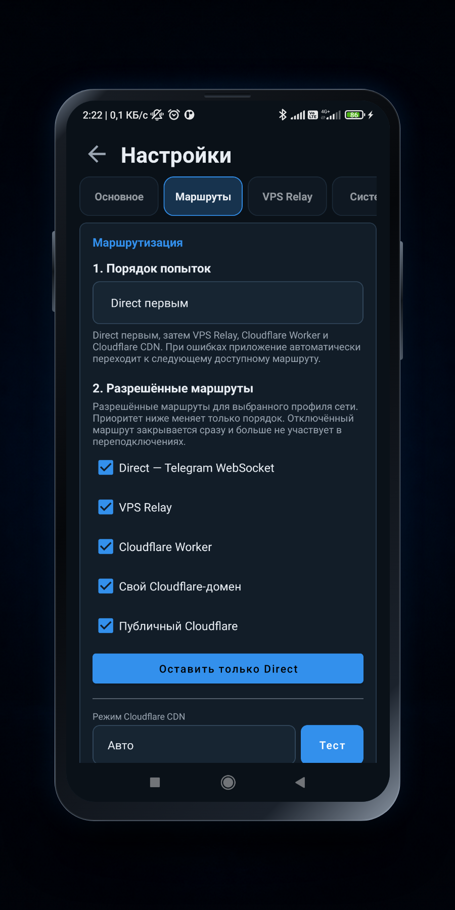

<a name="getting-started-top"></a>

# Быстрый старт TG Proxy

<p align="center">
  <strong>От установки APK до первого подтверждённого MTProto-маршрута Telegram</strong><br>
  Без root, ADB и ручного редактирования файлов
</p>

<p align="center">
  <a href="#before-start">До начала</a> ·
  <a href="#install">Установка</a> ·
  <a href="#permissions">Разрешения</a> ·
  <a href="#start-proxy">Запуск</a> ·
  <a href="#connect-telegram">Telegram</a><br>
  <a href="#check-result">Проверка</a> ·
  <a href="#routes">Маршруты</a> ·
  <a href="#problems">Проблемы</a> ·
  <a href="#diagnostics">Диагностика</a> ·
  <a href="#next-steps">Что дальше</a>
</p>

---

<a name="before-start"></a>

## До начала

Для первого запуска потребуются:

- телефон или планшет с **Android 5.0+**;
- установленный Telegram для Android;
- доступ в интернет;
- APK из официального раздела [TG Proxy Releases](https://github.com/Dushnyj/TG-Proxy/releases/latest).

VPS, домен и аккаунт Cloudflare **не обязательны**. Приложение можно установить и запустить
сразу, а дополнительные маршруты подключить позже.

```text
Telegram Android
  → локальный MTProto 127.0.0.1:1443
  → TG Proxy
  → Direct WS | VPS Relay | Cloudflare
  → Telegram DC
```

> [!NOTE]
> **TG Proxy — не системный VPN.** Через него проходят только локальные MTProto-соединения
> Telegram, включая обычные и media DC. Остальной трафик Android и звонки Telegram
> (`VoIP`, `WebRTC`, `P2P`, `STUN`, `TURN`) приложение не маршрутизирует.

<a name="install"></a>

## 1. Скачать и установить APK

### Выбрать файл

Откройте [последний релиз](https://github.com/Dushnyj/TG-Proxy/releases/latest) и скачайте APK:

| Файл | Для какого устройства |
| --- | --- |
| `android-universal-release.apk` | **Рекомендуется**, если архитектура устройства неизвестна |
| `android-arm64-v8a-release.apk` | большинство современных телефонов и планшетов |
| `android-armeabi-v7a-release.apk` | старые 32-битные ARM-устройства |
| `android-x86_64-release.apk` | преимущественно эмуляторы Android |

Названия файлов начинаются с номера версии, например
`TG-Proxy-v1.3.0-android-universal-release.apk`.

### Проверить SHA-256

Вместе с APK в релизе публикуется `SHA256SUMS.txt`. Для проверки universal APK в Windows:

```powershell
$apk = Get-ChildItem "$HOME\Downloads\TG-Proxy-v*-android-universal-release.apk" |
    Sort-Object LastWriteTime -Descending |
    Select-Object -First 1
Get-FileHash -LiteralPath $apk.FullName -Algorithm SHA256
```

Linux:

```bash
sha256sum TG-Proxy-v*-android-universal-release.apk
```

macOS:

```bash
shasum -a 256 TG-Proxy-v*-android-universal-release.apk
```

Полученный SHA-256 должен полностью совпасть со строкой этого APK в `SHA256SUMS.txt`.

### Установить

1. Откройте скачанный APK.
2. Если Android запросит разрешение, разрешите текущему браузеру или файловому менеджеру
   **установку приложений из этого источника**.
3. Подтвердите установку TG Proxy.
4. После установки при желании верните системный запрет для этого источника.

> [!TIP]
> Release APK с той же подписью устанавливается поверх предыдущей версии и сохраняет локальные
> настройки. Android не установит поверх него сборку с другой подписью.

<a name="permissions"></a>

## 2. Настроить разрешения и фоновую работу

### Первый системный запрос

При первом обычном запуске TG Proxy может запросить доступ к данным Wi‑Fi и геолокации. Эти
разрешения нужны, чтобы Android сообщил приложению **точное имя текущей Wi‑Fi-сети** и TG Proxy
мог хранить для неё отдельный профиль маршрутов.

На разных версиях Android запрос может называться:

- **Местоположение**;
- **Устройства поблизости** или доступ к данным Wi‑Fi;
- точное местоположение вместо приблизительного.

Если отказаться, сам прокси сможет работать, но имя Wi‑Fi может отображаться как недоступное,
а несколько сетей могут использовать общий скрытый профиль. Камера на этом этапе не нужна —
она запрашивается только при сканировании QR-кода Relay.

### Помощник «Работа в фоне»

После системного запроса приложение открывает помощник фоновой работы. Красная строка означает,
что условие ещё не выполнено; нажатие открывает соответствующий экран Android. После возврата
состояние обновляется автоматически.

<table>
  <tr>
    <td align="center"><br><sub>Первый системный запрос</sub></td>
    <td align="center"><br><sub>Помощник фоновой работы</sub></td>
  </tr>
</table>

Проверьте шесть пунктов:

1. **Запуск после перезагрузки** — включает восстановление прокси после загрузки устройства.
2. **Режим батареи** — для TG Proxy должно быть выбрано **Без ограничений** или аналогичное
   разрешение фоновой работы.
3. **Автозапуск производителя** — если такой системный экран существует, разрешите TG Proxy
   и после возврата подтвердите действие в приложении.
4. **Уведомления фонового сервиса** — на Android 13+ разрешите уведомления, чтобы работающий
   foreground service оставался видимым.
5. **Разрешение на точное имя Wi‑Fi** — разрешите доступ, если нужны отдельные профили для
   разных Wi‑Fi-сетей.
6. **Системная геолокация** — на Android, который скрывает SSID при выключенной геолокации,
   включите её для определения имени Wi‑Fi.

> [!IMPORTANT]
> Зелёная строка показывает только то, что приложение или Android смогли проверить. Некоторые
> оболочки не предоставляют достоверный API для OEM-автозапуска, поэтому этот пункт может
> потребовать ручного подтверждения. Ни одна Android-оболочка не даёт абсолютной гарантии,
> что фоновый процесс никогда не будет остановлен.

Кнопка **Не сейчас** позволяет закрыть помощник, но невыполненные условия останутся отмеченными.
Повторно открыть окно можно через **Настройки → Система → Настроить работу в фоне**.

<a name="start-proxy"></a>

## 3. Запустить локальный прокси

Вернитесь на главный экран и нажмите большую кнопку питания. Стандартный локальный endpoint:

```text
Host: 127.0.0.1
Port: 1443
Type: MTProto
```

После запуска нормальным первым состоянием является **Ожидание Telegram**. Оно означает:

- foreground service работает;
- локальный listener `127.0.0.1:1443` открыт;
- Telegram ещё не подключился к нему или пока не создал трафик.

> [!IMPORTANT]
> До первого подключения Telegram поле **Маршрут** может показывать **Не выбран**, а
> **Отклик MTProto**, трафик и число подключений — пустые значения. Это не ошибка: TG Proxy
> ещё не получил клиентское MTProto-соединение, для которого нужно выбрать upstream.

Маршруты и сетевые параметры можно менять во время работы. Локальный IP и порт изменяются
только после остановки прокси.

<a name="connect-telegram"></a>

## 4. Добавить TG Proxy в Telegram

### Рекомендуемый способ

1. Убедитесь, что TG Proxy запущен.
2. На главном экране нажмите синюю ссылку `tg://proxy?...`.
3. Разрешите открыть ссылку в Telegram.
4. В карточке MTProto-прокси нажмите **Добавить прокси** или **Подключить прокси** — название
   зависит от версии Telegram.
5. Убедитесь, что переключатель этого прокси в Telegram включён.

> [!CAUTION]
> Запущенный TG Proxy не может сам изменить настройки другого приложения. Если локальный
> прокси добавлен, но выключен в Telegram, TG Proxy будет исправно ждать подключения, однако
> активного маршрута, MTProto RTT и трафика Telegram не появится.

### Если ссылка не открылась

Добавьте MTProto-прокси вручную в настройках Telegram:

```text
Тип:    MTProto
Сервер: 127.0.0.1
Порт:   1443
Secret: значение после &secret= из ссылки TG Proxy
```

Полная ссылка копируется долгим нажатием. Если secret берётся из
**Настройки → Основное → Расширенные локальные параметры**, перед его 32 шестнадцатеричными
символами в Telegram укажите префикс `dd`.

Не публикуйте эту ссылку: она содержит локальный MTProto secret вашего приложения.

<a name="check-result"></a>

## 5. Убедиться, что подключение работает

Откройте любой чат или канал в Telegram и вернитесь в TG Proxy. Успешное подключение выглядит
так:

- главный статус — **Активен**;
- в поле **Маршрут** указано `Direct`, `VPS Relay`, `Cloudflare Worker` или Cloudflare CDN;
- появился **Отклик MTProto**;
- число подключений и счётчики трафика меняются при работе Telegram;
- Telegram показывает локальный прокси подключённым.

<p align="center">
  
</p>

<p align="center"><sub>Пример активного VPS Relay; у вас может отображаться Direct или Cloudflare</sub></p>

### Что означают основные состояния

| Состояние | Что происходит | Что делать |
| --- | --- | --- |
| **Остановлен** | foreground service и локальный listener выключены | нажать кнопку питания |
| **Запуск** | движок и listener запускаются | подождать несколько секунд |
| **Ожидание Telegram** | listener готов, но Telegram не открыл соединение | добавить и включить прокси в Telegram |
| **Подключение к Telegram** | Telegram подключился, приложение проверяет маршрут | дождаться результата |
| **Активен** | есть свежий подтверждённый MTProto-маршрут | подключение работает |
| **Проблема** | Telegram подключился, но текущий маршрут не прошёл проверку | включить резервный маршрут и открыть диагностику |

<details>
<summary><strong>Редкие переходные состояния</strong></summary>

| Состояние | Значение |
| --- | --- |
| **Перезапуск** | сервис выполняет автоматическую повторную попытку после ошибки |
| **Нет ответа** | сервис запущен, но прокси-движок не отвечает |
| **Спящий режим** | работа временно приостановлена внутренним режимом сна |

</details>

<a name="routes"></a>

## 6. Настроить маршруты

Откройте **Настройки → Маршруты**. Для активного профиля сети можно разрешить:

- **Direct — Telegram WebSocket**;
- **VPS Relay**;
- **Cloudflare Worker**;
- **Свой Cloudflare-домен**;
- **Публичный Cloudflare**.

<p align="center">
  
</p>

<p align="center"><sub>На примере вручную выбран порядок «Direct первым»; для первого запуска можно оставить «Авто»</sub></p>

В режиме **Авто** порядок зависит от типа сети:

| Сеть | Базовый порядок попыток |
| --- | --- |
| Wi‑Fi | Direct → VPS Relay → Worker → Cloudflare CDN |
| Мобильная сеть | VPS Relay → Worker/Cloudflare → Direct |

Приложение пробует только разрешённые и настроенные варианты. Не настроенный Relay, Worker или
собственный домен автоматически пропускается. Ошибки и cooldown временно сдвигают нездоровый
маршрут вниз, а новое MTProto-соединение переходит к следующему кандидату.

> [!CAUTION]
> **Direct WS на мобильной сети в большинстве случаев не работает или работает нестабильно.**
> Мобильный оператор может блокировать официальный Telegram ingress по IP или маршруту ещё до
> TLS. При этом тот же Direct WS может нормально работать через Wi‑Fi. Для мобильной сети
> оставляйте режим **Авто** и добавьте VPS Relay либо доступный Cloudflare-маршрут.

> [!NOTE]
> Доступность зависит от оператора, региона и режима фильтрации. Ни Direct, ни Cloudflare, ни
> зарубежный VPS не гарантируют работу в каждой strict-whitelist сети. Проверяйте результат
> именно на той Wi‑Fi или мобильной сети, для которой настраивается профиль.

Настройки и статистика сохраняются отдельно для обнаруженных Wi‑Fi-сетей и мобильных операторов.
Если Android не сообщает SSID, используется скрытый Wi‑Fi-профиль. Две SIM/eSIM одного оператора
могут использовать общий мобильный профиль.

Подробный алгоритм: **[Маршруты и автоматическое переключение](ROUTING.md)**.

<a name="problems"></a>

## 7. Если Telegram не подключается

| Что видно | Вероятная причина | Что проверить |
| --- | --- | --- |
| **Ожидание Telegram** | локальный прокси не включён в Telegram | откройте настройки прокси Telegram и включите `127.0.0.1:1443` |
| **Маршрут: Не выбран** | Telegram ещё не создал соединение | откройте чат, отправьте сообщение и проверьте переключатель прокси |
| **Подключение к Telegram** не завершается | разрешённые upstream-маршруты не отвечают | включите несколько маршрутов, затем повторите на текущей сети |
| **Проблема** | последнее реальное MTProto-соединение завершилось ошибкой | откройте диагностику и посмотрите проверки regular/media DC |
| Direct работает по Wi‑Fi, но не по мобильной сети | фильтрация или недоступный маршрут оператора | используйте **Авто**, VPS Relay или Cloudflare |
| Wi‑Fi отображается без имени | Android скрывает SSID | разрешите точное местоположение/данные Wi‑Fi и включите системную геолокацию |
| Прокси останавливается в фоне | ограничение батареи или OEM-автозапуска | откройте **Настройки → Система → Настроить работу в фоне** |
| Сообщения работают, а media не загружается | не отвечает media DC выбранного маршрута | включите резервный маршрут и сохраните полный диагностический ZIP |

После изменения маршрутов не требуется перезапускать приложение: новые параметры применяются
к следующим соединениям. Если Telegram продолжает держать старое соединение, выключите и снова
включите прокси в Telegram.

<a name="diagnostics"></a>

## 8. Собрать диагностику

Если проблема повторяется:

1. Откройте **Диагностика** на главном экране.
2. Нажмите **Сбросить диагностику**, чтобы убрать старые события.
3. Вернитесь в Telegram и воспроизведите проблему.
4. Снова откройте TG Proxy → **Диагностика**.
5. Нажмите **Сохранить ZIP**.
6. Просмотрите архив и приложите его к подходящей форме Issues.

Для проблем фоновой работы, смены сетевого профиля, автоматического переключения, VPS Relay или
media нужен именно ZIP: скриншот и краткая копия не содержат полной истории событий.

> [!IMPORTANT]
> TG Proxy маскирует raw Relay token и полный MTProto secret, но отчёт содержит технические
> сведения об устройстве, сети, доменах и маршрутах. Перед публикацией обязательно просмотрите
> архив и не добавляйте SSH-пароли, приватные ключи или owner-token.

- [Как читать и правильно сохранить диагностику](DIAGNOSTICS.md)
- [Ошибка Android-приложения](https://github.com/Dushnyj/TG-Proxy/issues/new?template=bug_report.yml)
- [Проблема VPS Relay или автонастройки](https://github.com/Dushnyj/TG-Proxy/issues/new?template=vps_relay.yml)
- [Полные правила обращения за помощью](../SUPPORT.md)

<a name="next-steps"></a>

## Что делать дальше

| Задача | Инструкция |
| --- | --- |
| Понять автовыбор и failover | [Маршруты](ROUTING.md) |
| Добавить готовое Relay-подключение | [Ссылка, QR-код и импорт](SHARING_AND_IMPORT.md) |
| Автоматически настроить собственный VPS | [VPS Relay](VPS_RELAY.md) |
| Получить бесплатный домен | [DuckDNS](DUCKDNS.md) |
| Настроить личный Worker | [Cloudflare Worker](CLOUDFLARE_WORKER.md) |
| Использовать собственный Cloudflare-домен | [Cloudflare-домен](CLOUDFLARE_DOMAIN.md) |
| Проверить хранение и передачу секретов | [Приватность и секреты](PRIVACY_AND_SECRETS.md) |
| Открыть весь комплект документов | [Индекс документации](README.md) |

---

<p align="center">
  <a href="../README.md">Главная страница</a> ·
  <a href="README.md">Вся документация</a> ·
  <a href="../SUPPORT.md">Поддержка</a>
</p>

<p align="center"><a href="#getting-started-top">Наверх ↑</a></p>
