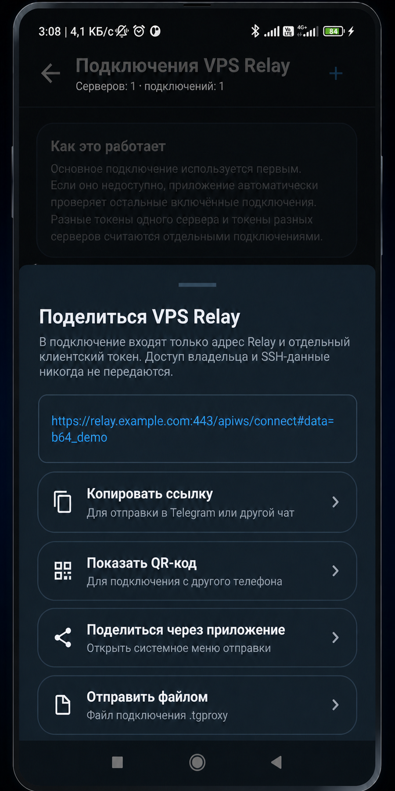
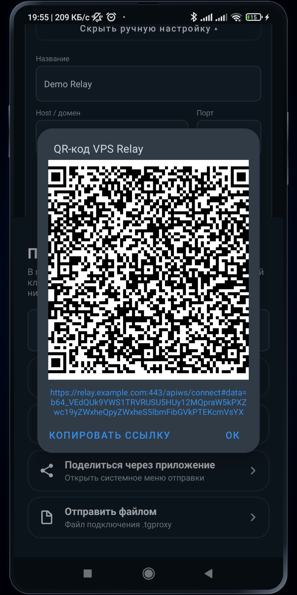
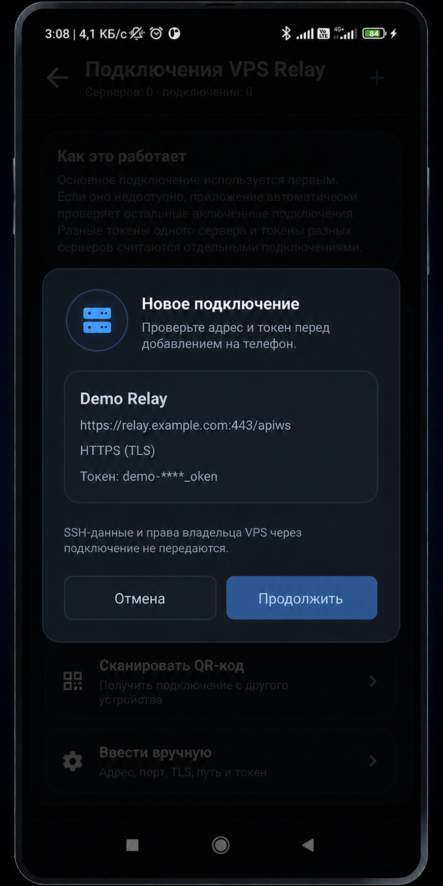

# Ссылка, QR-код и импорт VPS Relay

Одно Relay-подключение содержит публичный endpoint и **один client token**. SSH-доступ,
owner-token, DuckDNS token и другие подключения владельца не передаются.

## Поделиться подключением

1. Откройте **Настройки → Relay → Подключения VPS Relay**.
2. Откройте нужный токен.
3. Нажмите **Поделиться**.
4. Выберите один способ:
   - скопировать кликабельную ссылку;
   - показать QR-код;
   - отправить QR-код как PNG;
   - открыть системное меню **Поделиться**;
   - отправить `.tgproxy`-файл подключения.

<table>
  <tr>
    <td align="center"><br><sub>Единое меню</sub></td>
    <td align="center"><br><sub>QR-код</sub></td>
  </tr>
</table>

Внешняя ссылка имеет вид:

```text
https://relay.example.com/apiws/connect#data=b64_...
```

Payload находится после `#`. URL fragment не отправляется Relay, reverse proxy или DNS. Landing
page преобразует его в deep link `tgproxy://import?...`, который открывает TG Proxy.

## Импорт по ссылке

1. Нажмите ссылку на Android-устройстве.
2. Подтвердите открытие TG Proxy.
3. Проверьте host, port, TLS и path в окне **Добавить новое подключение VPS Relay**.
4. Выберите область применения:
   - только текущий сетевой профиль;
   - все сети.
5. Подтвердите импорт.

<p align="center">
  
</p>

Приложение не применяет внешнее подключение без подтверждения. До сохранения оно само
проверяет Relay, token и main/media DC Telegram; после импорта подключение можно сделать
основным или резервным для профиля.

## Импорт по QR-коду

1. На телефоне владельца откройте QR-код Relay.
2. На телефоне получателя откройте **Relay → Добавить подключение → Сканировать QR-код**.
3. Наведите камеру на код.
4. Проверьте данные и подтвердите область применения так же, как для ссылки.

Если системная камера распознала QR как HTTPS-ссылку, просто откройте её — результат тот же.
Полученный PNG можно передать непосредственно в TG Proxy через системное меню Android:
приложение ограниченно декодирует изображение, показывает preview и выполняет ту же проверку,
что и при сканировании камерой.

## Единое меню добавления

Кнопка **Добавить подключение** предлагает пять способов:

1. автонастроить собственный VPS;
2. вставить ссылку или текст;
3. открыть `.tgproxy`-файл;
4. сканировать QR-код;
5. ввести endpoint и token вручную.

Ни один способ не записывает Relay сразу. Сначала показывается адрес и masked token, затем
проверяются авторизация, версия, capabilities и main/media Telegram DC. Временный DNS/connect
сбой повторяется на активной сети Android; техническая причина остаётся в диагностике, а
пользователь получает понятное сообщение.

## Несколько токенов и Relay

- два client token одного endpoint сохраняются как два независимых подключения;
- один token можно сделать основным, остальные — резервными;
- несколько включённых Relay одного или разных VPS участвуют в автоматическом failover;
- отзыв одного token владельцем не отключает остальные;
- при передаче всегда выбирайте конкретный token: ссылка не содержит весь пул владельца.

Лучше создавать отдельный token для каждого человека или устройства. Тогда его можно отозвать,
не затрагивая других пользователей.

## Что нельзя отправлять

Никогда не прикладывайте к сообщению:

- SSH host/login/password вместе;
- приватный SSH key;
- owner/admin token;
- DuckDNS token;
- полный защищённый экспорт без заранее согласованного пароля.

Для обычного подключения достаточно ссылки, QR-кода или клиентского файла, созданного кнопкой
**Поделиться** в карточке конкретного токена.
