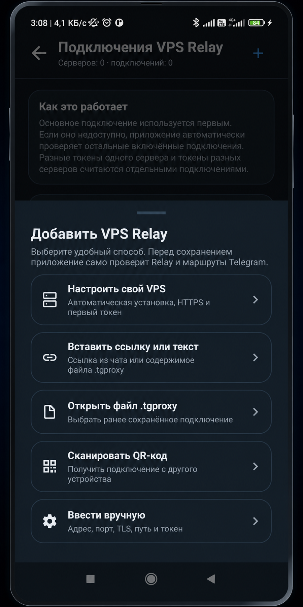
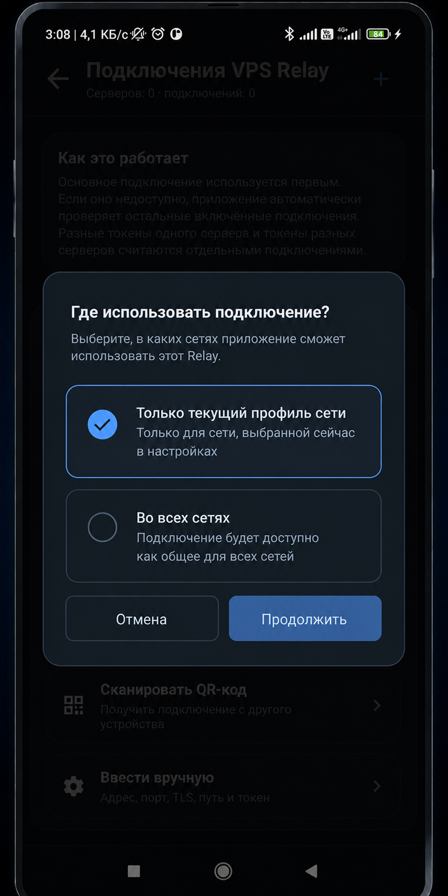

# Поделиться и импортировать VPS Relay

Эта инструкция описывает перенос **одного подключения VPS Relay** между Android-устройствами.
Отправитель выбирает конкретный client token, а получатель проверяет endpoint, задаёт область
применения и только после этого сохраняет подключение.

```text
Отправитель: подключение → ссылка / QR / PNG / .tgproxy
Получатель: предпросмотр → профиль сети → проверка Relay и DC → сохранение
```

> [!IMPORTANT]
> Ссылка, QR-код и `.tgproxy`-файл содержат действующий **client token**. Любой, кто получил
> такой носитель, сможет подключаться к Relay до отзыва token владельцем VPS.

## Навигация

- [Что именно передаётся](#contents)
- [Чем это отличается от экспорта профиля](#profile-export)
- [Какой способ выбрать](#choice)
- [Поделиться подключением](#share)
- [Ссылка подключения и URL fragment](#link)
- [Показать или отправить QR-код](#qr-share)
- [Отправить `.tgproxy`-файл](#file-share)
- [Импортировать подключение](#import)
- [Импорт по ссылке или тексту](#import-link)
- [Импорт из файла](#import-file)
- [Импорт по QR-коду](#import-qr)
- [Предпросмотр и область применения](#preview)
- [Проверка перед сохранением](#verification)
- [Повторный импорт и несколько токенов](#duplicates)
- [Удаление и отзыв доступа](#revoke)
- [Безопасная передача](#security)
- [Решение проблем](#troubleshooting)
- [Связанные инструкции](#related)

<a id="contents"></a>
## Что именно передаётся

Одно Relay-подключение — это публичный endpoint и **один** client token.

| Входит в подключение | Не входит в подключение |
|---|---|
| Название подключения | SSH host, login, пароль или private key |
| Host, port, TLS и WebSocket path | Owner/admin token |
| Один client token | DuckDNS token |
| Признак включённого подключения | Другие client tokens этого VPS |
| — | Подключения других VPS |
| — | Основное/резервное место в профилях сети |
| — | MTProto secret локального прокси |

Получатель не получает доступ к настройке сервера или owner-панели. Он получает ровно тот
клиентский доступ, который связан с выбранным token.

> [!TIP]
> Создавайте отдельный client token для каждого человека или устройства. Тогда потерянный
> телефон или одно скомпрометированное сообщение можно отозвать, не отключая остальных.

<a id="profile-export"></a>
## Чем это отличается от экспорта профиля

Раздел **Система → Импорт и экспорт** не дублирует кнопку **Поделиться** в карточке Relay:
он переносит настройки сетевого профиля, а не только одно подключение.

| Операция | Что переносит | Когда использовать |
|---|---|---|
| **Поделиться VPS Relay** | Endpoint + один client token | Дать человеку или второму устройству доступ к конкретному Relay |
| **Безопасный экспорт профиля** | Маршруты и настройки выбранного профиля без MTProto secret и без Relay | Передать несекретную конфигурацию сети |
| **Полный профиль с паролем** | Настройки профиля, MTProto secret и одно основное Relay-подключение | Личный перенос между своими устройствами |

Даже полный профиль не является резервной копией всего приложения: он не переносит пул Relay,
привязки остальных профилей, owner/SSH/DuckDNS-данные и системные разрешения Android.

<a id="choice"></a>
## Какой способ выбрать

| Ситуация | Рекомендуемый способ | Особенность |
|---|---|---|
| Отправить в Telegram или другой чат | **Копировать ссылку** или **Поделиться через приложение** | Самый быстрый вариант; вся ссылка является секретом |
| Телефоны находятся рядом | **Показать QR-код** | Ничего не нужно копировать или сохранять |
| Отправить QR удалённо | **Показать QR-код → Поделиться QR** | Передаётся PNG с тем же client token |
| Мессенджер повреждает длинные ссылки | **Отправить файлом** | Файл `tgproxy-vps-relay.tgproxy` содержит то же подключение |
| Ссылка уже скопирована | **Вставить ссылку или текст** | Рекомендуемый контролируемый импорт внутри приложения |
| Получен файл | **Открыть файл .tgproxy** | Можно выбрать файл из системного проводника Android |
| Получен PNG с QR | Поделиться изображением в **TG Proxy** | Приложение распознает QR из изображения |
| Есть только host, port, path и token | **Ввести вручную** | Запасной способ без импорта |

<a id="share"></a>
## Поделиться подключением

1. Откройте **Настройки → VPS Relay → Подключения VPS Relay**.
2. Откройте нужный сервер и конкретное подключение/token.
3. Нажмите **Поделиться**.
4. Выберите ссылку, QR-код, системное меню Android или файл.

<table>
  <tr>
    <td align="center"><br><sub>Четыре способа передачи</sub></td>
    <td align="center"><br><sub>QR можно показать, скопировать или отправить</sub></td>
  </tr>
</table>

Меню всегда формируется для **открытого подключения**. Если у одного VPS несколько client
tokens, сначала убедитесь, что открыта карточка нужного token.

### Копировать ссылку

Копирует готовую HTTPS-ссылку в буфер обмена. Её можно вставить в Telegram, почту или другой
канал связи. Получатель открывает ссылку на Android либо вставляет её в TG Proxy вручную.

### Поделиться через приложение

Открывает стандартное меню Android и передаёт ссылку выбранному приложению как текст. Это
удобнее, чем вручную открывать чат и вставлять содержимое буфера обмена.

> [!CAUTION]
> Предпросмотр ссылки в чате, облачная синхронизация буфера обмена и история сообщений могут
> сохранить полный URL. Передавайте его только конкретному получателю в доверенном канале.

<a id="link"></a>
## Ссылка подключения и URL fragment

Новая ссылка имеет вид:

```text
https://relay.example.com:443/apiws/connect#data=b64_...
```

- `/apiws/connect` — публичная landing page Relay;
- всё после `#data=` — сериализованное клиентское подключение;
- landing page открывает приватную схему `tgproxy://import?data=...` на телефоне;
- если автоматическое открытие не сработало, на странице есть кнопка **Открыть TG Proxy**.

Браузер **не отправляет URL fragment после `#`** на Relay, reverse proxy, DNS или в обычный
HTTP access log. Это уменьшает раскрытие token на серверной стороне, но не делает ссылку
несекретной: чат, получатель, браузер и буфер обмена видят её целиком.

> [!NOTE]
> Старые ссылки могли хранить payload в query-параметре. Современный Relay принимает их для
> совместимости, но для новой передачи всегда создавайте ссылку заново через приложение.

<a id="qr-share"></a>
## Показать или отправить QR-код

В меню **Поделиться VPS Relay** выберите **Показать QR-код**.

- **ОК** закрывает окно;
- **Копировать ссылку** кладёт ту же ссылку в буфер обмена;
- **Поделиться QR** создаёт PNG и открывает системное меню отправки Android.

QR-код и PNG содержат ту же ссылку и тот же client token. PNG удобен для удалённой передачи,
но его нельзя публиковать в issue, README, общий чат или облачную папку с открытым доступом.

<a id="file-share"></a>
## Отправить `.tgproxy`-файл

Кнопка **Отправить файлом** создаёт `tgproxy-vps-relay.tgproxy` и открывает системное меню
Android. Это текстовый файл подключения, а не зашифрованный архив.

Файл подходит, если:

- мессенджер обрезает длинную ссылку;
- нужно сохранить подключение локально для второго устройства;
- ссылка не распознаётся браузером как открываемая TG Proxy.

> [!IMPORTANT]
> Расширение `.tgproxy` не защищает содержимое. Храните и удаляйте файл так же аккуратно, как
> пароль. Для личного переноса полного профиля используйте отдельный экспорт **с паролем**.

<a id="import"></a>
## Импортировать подключение

Контролируемый путь внутри приложения:

1. Откройте **Настройки → VPS Relay → Подключения VPS Relay**.
2. Нажмите `+`.
3. Выберите источник подключения.
4. Проверьте данные в окне **Новое подключение**.
5. Выберите область применения.
6. Дождитесь проверки или явно сохраните подключение без неё.

<p align="center">
  
</p>

Все варианты из этого меню — вставка текста, файл и сканирование камерой — проходят один и тот
же предпросмотр, выбор области и подробную проверку Relay.

<a id="import-link"></a>
## Импорт по ссылке или тексту

### Вставить внутри приложения

1. Скопируйте полученную ссылку целиком, включая часть после `#data=`.
2. Выберите **Добавить VPS Relay → Вставить ссылку или текст**.
3. Вставьте ссылку и нажмите **Импорт**.
4. Сверьте название, endpoint, TLS и замаскированный token.
5. Нажмите **Продолжить**.

Это рекомендуемый вариант: вы заранее находитесь в списке Relay и видите современный
предпросмотр до любого сохранения.

### Открыть ссылку напрямую

1. Нажмите ссылку на Android-устройстве.
2. Если Android спросит приложение, выберите **TG Proxy**.
3. На landing page нажмите **Открыть TG Proxy**, если приложение не открылось автоматически.
4. Проверьте показанные изменения, выберите профиль/сети и подтвердите импорт.

Если Android открыл обычный браузер и не предложил TG Proxy, скопируйте адрес и используйте
первый способ. Не удаляйте окончание `#data=...`.

<a id="import-file"></a>
## Импорт из файла

Есть два равнозначных пути:

- **Добавить VPS Relay → Открыть файл .tgproxy** и выбрать файл;
- открыть полученный `.tgproxy` в системном проводнике Android и выбрать **TG Proxy**.

После чтения файла приложение показывает endpoint и замаскированный token. Если вместо
предпросмотра появляется ошибка формата, попросите отправителя создать файл заново из карточки
конкретного подключения.

<a id="import-qr"></a>
## Импорт по QR-коду

### Сканировать с другого экрана

1. На телефоне отправителя откройте **Поделиться → Показать QR-код**.
2. На телефоне получателя выберите **Добавить VPS Relay → Сканировать QR-код**.
3. Разрешите доступ к камере.
4. Наведите камеру на QR и дождитесь распознавания.
5. Проверьте endpoint и token в предпросмотре.

Сканер TG Proxy всегда открывается в **портретной ориентации** и не меняет системную настройку
автоповорота телефона.

### Импортировать полученный PNG

1. Откройте изображение в галерее, Telegram или файловом менеджере.
2. Нажмите системную кнопку **Поделиться**.
3. Выберите **TG Proxy**.
4. Приложение распознает QR и покажет тот же предпросмотр.

Если TG Proxy отсутствует в списке, сохраните PNG локально и попробуйте поделиться им из
системной галереи. Альтернатива — попросить обычную ссылку или `.tgproxy`-файл.

<a id="preview"></a>
## Предпросмотр и область применения

Перед сохранением проверьте:

- понятное название подключения;
- ожидаемый host и port;
- `HTTPS (TLS)` для обычного публичного подключения;
- точный WebSocket path, обычно `/apiws`;
- замаскированный token, чтобы отличить несколько подключений одного сервера.

<table>
  <tr>
    <td align="center"><br><sub>Проверка endpoint и token</sub></td>
    <td align="center"><br><sub>Область применения</sub></td>
  </tr>
</table>

При импорте из списка подключений доступны:

- **Только текущий профиль сети** — Relay используется только в выбранном сейчас профиле
  Wi-Fi/SIM;
- **Во всех сетях** — подключение добавляется в общий пул.

При открытии внешней ссылки Android может дополнительно предложить ранее сохранённые сетевые
профили. Выбор профиля не копирует token повторно: он определяет, в каких сетях это подключение
разрешено использовать.

> [!CAUTION]
> Не продолжайте, если host, TLS или path отличаются от данных отправителя. Замаскированный
> token помогает сравнить подключения, но не доказывает, что отправитель доверенный.

<a id="verification"></a>
## Проверка перед сохранением

После выбора области приложение запускает пять этапов:

1. **Связь с сервером** — DNS, TCP, TLS и WebSocket;
2. **Токен и версия Relay** — авторизация и совместимость;
3. **Состояние службы Relay** — health, version и capabilities;
4. **Маршруты на сервере** — безопасная server-side проверка;
5. **Основные и медиа DC Telegram** — отдельный результат для каждого доступного DC и роли.

Окно показывает текущий этап, число оставшихся проверок, зелёные отметки завершённых пунктов и
полный список DC. Один успешный HTTPS-запрос не считается полной проверкой Telegram.

Кнопка **Без проверки** сохраняет подключение явно, если сеть получателя сейчас недоступна.
Такое подключение может не работать до исправления DNS, TLS, token или маршрутов. После
сохранения откройте карточку и запустите **Проверить подключение** повторно.

> [!NOTE]
> Проверяется сам Relay, а не настройка Telegram на телефоне. Для реальной работы Telegram
> должен использовать локальный MTProto-прокси `127.0.0.1:1443`.

<a id="duplicates"></a>
## Повторный импорт и несколько токенов

Приложение различает подключения по endpoint **и** client token:

| Повторный импорт | Результат |
|---|---|
| Тот же endpoint + тот же token | Обновляется существующее подключение, дубликат не создаётся |
| Тот же endpoint + другой token | Создаётся отдельное подключение того же сервера |
| Другой endpoint + тот же текст token | Создаётся отдельное подключение другого сервера |

После импорта откройте сервер в **Подключениях VPS Relay**. Для каждого профиля можно включить
несколько подключений и выбрать одно основным; остальные участвуют в автоматическом failover.

> [!TIP]
> Если владелец дал два token одного VPS, подпишите их понятными именами, например
> `Личный` и `Планшет`. Не заменяйте один token другим в ручной настройке — импортируйте каждое
> подключение отдельно.

<a id="revoke"></a>
## Удаление и отзыв доступа

Это разные операции:

- **Удалить подключение** на телефоне — убрать его только из локального хранилища;
- **Не использовать в профиле** — оставить запись, но исключить её из конкретной сети;
- **Отозвать token** в owner-панели VPS — запретить новые подключения и закрыть его активные
  сессии на сервере.

Если ссылка, QR или файл попали не тому человеку:

1. владелец открывает **Управление владельца VPS**;
2. находит соответствующий token;
3. отзывает его;
4. создаёт новый отдельный token;
5. передаёт новую ссылку только нужному получателю.

Удаление сообщения или локального файла не гарантирует, что копия не сохранилась у получателя.
Надёжно прекращает доступ только отзыв token на Relay.

<a id="security"></a>
## Безопасная передача

Перед отправкой:

- выберите token конкретного пользователя/устройства;
- проверьте получателя и канал связи;
- не отправляйте client token вместе с SSH или owner-данными;
- не публикуйте ссылку, QR или `.tgproxy` в GitHub issue;
- не делайте скриншот QR для публичной инструкции;
- после потери устройства отзовите его token;
- для демонстрации используйте только `relay.example.com` и нерабочие тестовые данные.

Никогда не передавайте обычному пользователю:

- SSH-пароль или private key;
- owner/admin token;
- DuckDNS token;
- production-конфиг Relay или `/var/lib/tgproxy-relay/state.json`;
- полный профиль без надёжного отдельного пароля.

Подробная модель хранения секретов: [PRIVACY_AND_SECRETS.md](PRIVACY_AND_SECRETS.md).

<a id="troubleshooting"></a>
## Решение проблем

### Ссылка открылась как обычная страница

- нажмите **Открыть TG Proxy** на landing page;
- проверьте, что TG Proxy установлен;
- скопируйте полный URL и выберите **Вставить ссылку или текст**;
- убедитесь, что часть `#data=...` не была удалена мессенджером.

### `UnknownHostException` или «Телефон не смог связаться с Relay»

Это обычно означает, что текущая сеть не разрешила host через DNS или не может достичь
сервера. Переключите сеть, отключите нестабильный private DNS, проверьте адрес и повторите
проверку. Сам файл при этом может быть исправен.

### Токен отклонён

- проверьте, что выбран именно client token, а не owner token;
- попросите владельца убедиться, что token не отозван;
- если на телефоне несколько token этого VPS, откройте правильную карточку;
- импортируйте новый token как отдельное подключение.

### Ошибка HTTPS/TLS

Host ссылки должен совпадать с сертификатом. Проверьте DNS, срок сертификата и системные дату/
время Android. Не отключайте TLS только ради обхода ошибки публичного Relay.

### QR не распознаётся

- увеличьте яркость экрана отправителя и протрите камеру;
- держите весь квадрат QR внутри рамки;
- для PNG используйте системное **Поделиться → TG Proxy**;
- попросите ссылку или `.tgproxy`-файл как запасной вариант.

### Первая проверка не прошла, повторная прошла

Временный DNS/connect сбой возможен сразу после смены Wi-Fi/SIM, пробуждения телефона или
обновления DNS. Приложение не сохраняет неподтверждённый Relay молча: повторите проверку после
стабилизации сети либо осознанно выберите **Без проверки**.

### Что приложить к сообщению о проблеме

1. Повторите ошибку на проблемной Wi-Fi или мобильной сети.
2. Откройте **Диагностика**.
3. Нажмите **Сохранить ZIP**.
4. Просмотрите архив и прикрепите его к issue или личному сообщению поддержки.
5. Укажите способ импорта, этап ошибки и работает ли тот же Relay в другой сети.

Не прикладывайте исходную ссылку, QR, `.tgproxy` или raw token. Полная инструкция:
[DIAGNOSTICS.md](DIAGNOSTICS.md).

<a id="related"></a>
## Связанные инструкции

- [VPS Relay: подключение, автонастройка и управление](VPS_RELAY.md)
- [Требования к VPS](https://github.com/Dushnyj/TG-Proxy-Relay/blob/main/docs/VPS_REQUIREMENTS.md)
- [Настройка бесплатного адреса DuckDNS](DUCKDNS.md)
- [Сетевые профили и выбор маршрута](ROUTING.md)
- [Диагностика и полный ZIP](DIAGNOSTICS.md)
- [Данные, приватность и секреты](PRIVACY_AND_SECRETS.md)
- [Поддержка](../SUPPORT.md)
- [Вся документация](README.md)

<p align="center">
  <a href="../README.md">Главная страница</a> ·
  <a href="VPS_RELAY.md">VPS Relay</a> ·
  <a href="DIAGNOSTICS.md">Диагностика</a>
</p>
