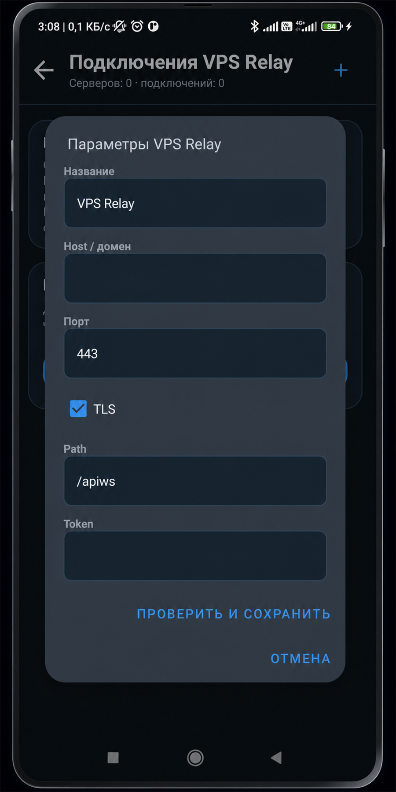

# VPS Relay: подключение, автонастройка и управление

VPS Relay — личный серверный маршрут TG Proxy. Телефон устанавливает защищённое
WebSocket-соединение с вашим Relay, а Relay подключается к нужному Telegram DC по TCP.

```text
Telegram → 127.0.0.1:1443 → TG Proxy → WSS/HTTPS → VPS Relay → Telegram DC
```

> [!TIP]
> VPS Relay особенно полезен в мобильных сетях, где Direct WS часто не проходит, а также
> когда публичные Cloudflare-маршруты нестабильны или получают `HTTP 429`.

## Навигация

- [Когда нужен VPS Relay](#when)
- [Какой сценарий выбрать](#choice)
- [Что хранит приложение](#concepts)
- [Требования к VPS](#requirements)
- [Добавить готовое подключение](#import)
- [Ввести подключение вручную](#manual)
- [Что именно проверяет приложение](#verification)
- [Автоматически настроить свой VPS](#auto-setup)
- [Повторная настройка и существующие токены](#token-reuse)
- [Несколько серверов, токенов и failover](#multiple)
- [Управление владельца](#owner)
- [Поделиться ссылкой, QR-кодом или файлом](#sharing)
- [Обновление Relay](#update)
- [Безопасность и локальные данные](#security)
- [Решение проблем](#troubleshooting)
- [Документация администратора сервера](#server-docs)

<a id="when"></a>
## Когда нужен VPS Relay

Используйте VPS Relay, если:

- Direct WS работает в одной сети, но блокируется мобильным оператором или другой сетью;
- нужен стабильный резерв независимо от публичного Cloudflare-пула;
- вы хотите контролировать сервер, домен, токены и список подключённых устройств;
- разным людям или устройствам нужны отдельные отзываемые токены;
- для разных Wi-Fi/SIM-профилей нужны разные основные и резервные Relay.

VPS Relay **не является системным VPN**. Telegram по-прежнему подключается к локальному
MTProto-прокси `127.0.0.1:1443`, а TG Proxy выбирает маршрут для каждого нового соединения.

<a id="choice"></a>
## Какой сценарий выбрать

| Ситуация | Что открыть | Что потребуется |
|---|---|---|
| Вам прислали ссылку | **Добавить VPS Relay → Вставить ссылку или текст** | Только ссылка |
| Вам прислали файл | **Добавить VPS Relay → Открыть файл .tgproxy** | Файл подключения |
| Relay показан на другом телефоне | **Добавить VPS Relay → Сканировать QR-код** | Камера |
| Есть host, port, path и client token | **Добавить VPS Relay → Ввести вручную** | Параметры подключения |
| Вы купили чистый VPS | **Добавить VPS Relay → Настроить свой VPS** | SSH-доступ к серверу |
| Relay уже установлен и нужен новый пользователь | **Управление владельца VPS → Создать токен** | Сохранённый owner-доступ |

> [!NOTE]
> Обычному пользователю не нужны SSH-пароль и owner token. Для подключения достаточно
> отдельной ссылки, QR-кода или `.tgproxy`-файла с client token.

<a id="concepts"></a>
## Что хранит приложение

В интерфейсе разделены три сущности:

| Сущность | Значение |
|---|---|
| **Сервер** | Один публичный endpoint: host, port, TLS и path |
| **Подключение** | Endpoint + один client token; два токена одного сервера — два подключения |
| **Профиль сети** | Настройки для конкретного Wi-Fi/SIM: основное, резервные и отключённые подключения |

Список **Подключения VPS Relay** группирует токены по серверу. Один и тот же token для одного
endpoint при повторном импорте обновляет существующую запись, а не создаёт дубликат. Другой
token того же endpoint сохраняется как отдельное подключение.

<table>
  <tr>
    <td align="center"><br><sub>Список подключений</sub></td>
    <td align="center"><br><sub>Пять способов добавления</sub></td>
  </tr>
</table>

<a id="requirements"></a>
## Требования к VPS

Для личного Relay обычно достаточно:

| Ресурс | Рекомендация |
|---|---|
| CPU | 1 vCPU |
| RAM | 512 MiB–1 GiB |
| Диск | 5 GiB и больше |
| Сеть | Публичный IPv4 или IPv6, без CGNAT |
| Доступ | SSH: `root` или пользователь с `sudo` без запроса пароля |
| Порты | TCP `22`, `80` и `443` |
| ОС | Обычный Linux VPS; поддерживаемая архитектура и init-система |

Relay не требует мощного сервера, но ему нужен стабильный исходящий доступ к DNS, HTTPS и
Telegram DC. Внутренний порт `127.0.0.1:18080` нельзя публиковать в интернет.

Полная матрица дистрибутивов, архитектур, init-систем и сетевых требований находится в
[VPS_REQUIREMENTS.md](https://github.com/Dushnyj/TG-Proxy-Relay/blob/main/docs/VPS_REQUIREMENTS.md).

<a id="import"></a>
## Добавить готовое подключение

1. Откройте **Настройки → VPS Relay**.
2. Нажмите **Добавить VPS Relay** или откройте **Подключения VPS Relay** и нажмите `+`.
3. Выберите один из пяти способов:
   - **Вставить ссылку или текст**;
   - **Открыть файл .tgproxy**;
   - **Сканировать QR-код**;
   - **Ввести вручную**;
   - **Настроить свой VPS**.
4. Проверьте имя, endpoint, TLS, path и замаскированный token в окне предпросмотра.
5. Выберите область применения:
   - **только текущий профиль сети**;
   - **во всех сетях**.
6. Запустите проверку и сохраните подключение.

<p align="center">
  
</p>

Внешние данные никогда не применяются молча: ссылка, QR-код, файл и текст проходят один и тот
же preview и одну и ту же сетевую проверку. Если сеть временно недоступна, подключение можно
явно **сохранить без проверки**, но оно может не заработать до исправления причины.

> [!IMPORTANT]
> Импорт Relay и перенос профиля — разные операции. Ссылка/QR/файл добавляют один client token.
> Перенос профиля находится в разделе подключения и не является резервной копией всех Relay,
> owner-, SSH- или DuckDNS-данных.

<a id="manual"></a>
## Ввести подключение вручную

Выберите **Добавить VPS Relay → Ввести вручную** и заполните:

| Поле | Пример | Описание |
|---|---|---|
| Название | `Домашний Relay` | Любая понятная подпись на телефоне |
| Host / домен | `relay.example.com` | Без `https://` и без path |
| Порт | `443` | Обычно `443` для TLS |
| TLS | включено | Должно соответствовать серверу |
| Path | `/apiws` | Должен точно совпадать с Relay и reverse proxy |
| Token | выданный client token | Не owner/admin token |

<p align="center">
  
</p>

Нажмите **Проверить и сохранить**. `Path` должен начинаться с `/` и не содержать query или
fragment. Служебные пути `/healthz`, `/version`, `/capabilities` и `/test-routes` использовать
как WebSocket path нельзя.

<a id="verification"></a>
## Что именно проверяет приложение

Полная проверка показывает прогресс и результат каждого этапа:

1. **Связь с сервером** — DNS, TCP, TLS и WebSocket;
2. **Токен и версия Relay** — авторизация и совместимость;
3. **Состояние службы Relay** — `/healthz`, `/version`, `/capabilities`;
4. **Маршруты на сервере** — безопасная server-side проверка `/test-routes`;
5. **Основные и медиа DC Telegram** — настоящий `req_pq/resPQ` для каждого доступного
   production/test DC и роли main/media.

Один успешный HTTP или WebSocket handshake не считается доказательством работы Telegram.
Проверка Relay не зависит от того, включён ли локальный прокси в Telegram, но для реальной
работы Telegram должен использовать `127.0.0.1:1443`.

> [!TIP]
> Если ошибка появилась только на первой попытке, повторите проверку после стабилизации сети.
> `UnknownHostException` означает сбой DNS/доступа к host в текущей сети, а не повреждение
> импортируемого файла.

<a id="auto-setup"></a>
## Автоматически настроить свой VPS

Мастер работает по SSH, сначала выполняет read-only аудит, затем показывает план и только после
подтверждения меняет сервер.

### Перед началом

Подготовьте:

- публичный IP VPS;
- SSH port, пользователя и пароль;
- пользователя `root` либо пользователя с passwordless `sudo`;
- открытые входящие TCP-порты `22`, `80`, `443`;
- для своего домена — A/AAAA-запись на публичный IP VPS;
- для DuckDNS — имя и token из личного кабинета.

> [!CAUTION]
> Не отправляйте SSH-пароль, owner token или DuckDNS token другому пользователю. Создайте для
> него отдельный client token и поделитесь только подключением.

### Шаг 1. Доступ к серверу

Введите SSH host/IP, port, пользователя и пароль. Переключатель сохранения определяет, останется
ли SSH-пароль в защищённом локальном хранилище для последующего управления.

При первом подключении приложение показывает тип SSH-ключа сервера и `SHA256:` fingerprint.
Сверьте его с панелью хостинга или консолью VPS и подтвердите. После этого host key закрепляется;
неожиданная смена ключа блокирует подключение. После подтверждённой переустановки VPS используйте
**Сбросить SSH-ключ**.

<p align="center">
  
</p>

### Шаг 2. Публичный адрес и HTTPS

| Вариант | Когда выбирать | Что делает приложение |
|---|---|---|
| **Без домена** | Нужен самый быстрый запуск | Выпускает короткоживущий IP-сертификат и использует `443` |
| **Бесплатный адрес DuckDNS** | Нет собственного домена | Обновляет DuckDNS, ждёт DNS и настраивает HTTPS |
| **У меня есть домен** | Домен/поддомен уже принадлежит вам | Проверяет A/AAAA и безопасно встраивает маршрут в web stack |

Пошаговое создание бесплатного имени описано в [DUCKDNS.md](DUCKDNS.md).

### Шаг 3. Аудит и план

До изменений приложение проверяет:

- Linux-дистрибутив, архитектуру, init-систему и пакетный менеджер;
- публичный IP и DNS выбранного имени;
- занятые порты и существующие сертификаты;
- nginx, Apache, Caddy, Docker и найденные домены;
- существующий Relay и `/etc/tgproxy-relay/config.json`;
- возможность изолированно добавить WebSocket path, не переписывая чужой сайт.

Если найден блокер, сервер не изменяется. Например: домен указывает на другой IP, path уже занят,
`80/443` обслуживает неизвестный процесс или web stack нельзя изменить безопасно.

### Шаг 4. Установка и проверка

После подтверждения плана мастер:

1. создаёт backup затрагиваемых конфигураций;
2. устанавливает совместимый release Relay и недостающие пакеты;
3. создаёт службу для найденной init-системы;
4. настраивает reverse proxy, TLS и автоматическое продление сертификата;
5. оставляет ядро Relay на loopback `127.0.0.1:18080`;
6. проверяет HTTPS, авторизацию, основные и медиа DC Telegram;
7. сохраняет готовое подключение на телефоне.

Backup привязан к transaction id. При неуспешной финальной проверке rollback восстанавливает
только изменения текущего запуска и не использует случайную старую копию.

Автонастройка поддерживает распространённые семейства Linux и пакетные менеджеры `apt`, `dnf`,
`microdnf`, `yum`, `zypper`, `apk`, `pacman`, `xbps` и Portage. Служба создаётся для `systemd`,
OpenRC, runit или SysV; на минимальной системе используется переносимый fallback.

<a id="token-reuse"></a>
## Повторная настройка и существующие токены

Перед созданием client token приложение ищет локально сохранённые токены того же endpoint.

- Если secret сохранён на этом телефоне, мастер предлагает **использовать существующий token**
  или создать отдельный новый.
- Если сервер уже содержит token, но его raw secret на телефоне утрачен, восстановить secret из
  хэша нельзя. Импортируйте старую ссылку/QR/файл либо создайте новый token.
- Один и тот же endpoint + token не дублируется при повторном импорте.
- Новый token того же Relay становится отдельным подключением и может иметь собственный статус.

> [!IMPORTANT]
> Relay хранит хэши client token, а не их исходные secrets. Поэтому существующий token можно
> выбрать только там, где его secret уже сохранён локально или заново импортирован.

<a id="multiple"></a>
## Несколько серверов, токенов и failover

Для каждого профиля сети подключение может быть:

- **Основное** — пробуется первым;
- **Резерв** — используется, если основное недоступно;
- **Отключено** — не участвует только в этом профиле.

Можно одновременно хранить:

- несколько токенов одного VPS;
- токены разных доменов одного VPS;
- несколько независимых VPS;
- разные основные и резервные наборы для Wi-Fi и SIM.

Недоступность одного подключения не отключает остальные. Переключение происходит для нового
MTProto-соединения: уже оборванный поток нельзя перенести на другой сервер посередине передачи.
Автовыбор маршрутов, cooldown и приоритеты описаны в [ROUTING.md](ROUTING.md).

Удаление карточки на телефоне удаляет только локальное подключение и привязки профилей. Оно
**не отзывает token на сервере**. Для отзыва откройте owner-панель и удалите token там.

<a id="owner"></a>
## Управление владельца

Owner-панель доступна только на телефоне, где сохранён owner token после автонастройки или
добавления данных владельца. Обычный client token прав управления не даёт.

Владелец может:

- создавать именованные client token;
- выбрать **Использовать на этом телефоне** для нового token;
- открыть сохранённый token и применить его к текущему профилю;
- поделиться конкретным token;
- видеть устройства и активные сессии token;
- отключить текущие сессии устройства;
- заблокировать или разблокировать устройство;
- отозвать token, не затрагивая другие подключения.

В карточке устройства отображаются нормализованная марка/модель, версии TG Proxy и Android,
первая/последняя активность, приблизительная GeoIP-страна/город и число сессий. GeoIP — это
оценка по публичному IP, а не GPS телефона.

Если нажать **Забыть данные владельца на этом телефоне**, локальные SSH-, owner- и сохранённые
token secrets удаляются с телефона. Сервер, выданные токены и подключения других устройств
продолжают работать.

<a id="sharing"></a>
## Поделиться ссылкой, QR-кодом или файлом

Откройте конкретное подключение и нажмите **Поделиться**. Доступны:

- **Копировать ссылку**;
- **Показать QR-код**;
- отправить QR-код как PNG;
- **Поделиться через приложение** — системное меню Android;
- **Отправить файлом** — `.tgproxy`.

Передаётся только выбранный endpoint и один client token. SSH, owner token, DuckDNS token и
другие подключения не включаются.

Обычная ссылка имеет вид:

```text
https://relay.example.com/apiws/connect#data=b64_...
```

Payload находится после `#` и не отправляется HTTP-серверу, но сама ссылка остаётся **bearer
credential**: любой получивший её сможет подключаться до отзыва token.

> [!CAUTION]
> Не публикуйте рабочую ссылку, QR-код или `.tgproxy`-файл в открытом issue. Для каждого человека
> или устройства лучше выпускать отдельный token — тогда его можно отозвать независимо.

Подробные пошаговые сценарии: [SHARING_AND_IMPORT.md](SHARING_AND_IMPORT.md).

<a id="update"></a>
## Обновление Relay

Если серверная версия ниже совместимой, приложение предлагает обновление владельцу с сохранённым
SSH-доступом. Пользователь импортированного token не может обновить чужой VPS — ему нужно
сообщить владельцу.

Перед обновлением используются тот же аудит, backup и проверка, что при установке. Ручные
обновления и release assets описаны в серверном репозитории
[Dushnyj/TG-Proxy-Relay](https://github.com/Dushnyj/TG-Proxy-Relay).

<a id="security"></a>
## Безопасность и локальные данные

- client token даёт только право подключения;
- owner/admin token даёт право управления и не входит в ссылку/QR/файл клиента;
- SSH-пароль сохраняется только при включённом переключателе;
- секреты шифруются через Android Keystore и не входят в Android backup;
- переустановка/очистка данных приложения может удалить локальные owner-, SSH-, DuckDNS- и
  client secrets;
- первый SSH fingerprint подтверждается явно, а последующая смена host key блокируется;
- сервер хранит хэши client token и не может восстановить утраченный raw secret;
- публичный reverse proxy принимает WSS/HTTPS, а ядро Relay остаётся на loopback.

Полная модель хранения и экспорта: [PRIVACY_AND_SECRETS.md](PRIVACY_AND_SECRETS.md).

<a id="troubleshooting"></a>
## Решение проблем

| Симптом | Что означает | Что сделать |
|---|---|---|
| `UnknownHostException` | DNS не разрешил host в текущей сети | Переключить сеть, проверить DNS/A/AAAA и повторить |
| TLS/certificate error | Имя, время устройства или сертификат не совпадают | Проверить host, часы, сертификат и reverse proxy |
| Token rejected / `401` | Неверный или отозванный client token | Импортировать правильный token или попросить владельца создать новый |
| Relay доступен, но DC не проходят | Сервер не достигает части Telegram DC или topology устарела | Запустить полную проверку, обновить Relay/topology |
| Домен указывает не на этот VPS | A/AAAA не совпадает с публичным IP | Исправить DNS и дождаться обновления |
| Path занят | На домене уже есть конфликтующий маршрут | Выбрать безопасный свободный path или настроить вручную |
| Проверка прошла, Telegram не работает | Telegram не использует локальный MTProto-прокси | Включить `127.0.0.1:1443` в Telegram |
| Импорт сработал со второй попытки | Первый DNS/connect запрос попал во временный сетевой сбой | Повторить проверку; при повторении приложить диагностику |

### Как подготовить отчёт

1. Откройте **Диагностика**.
2. Запустите полную проверку.
3. Сохраните **полный ZIP**, а не только скриншот ошибки.
4. Создайте issue по шаблону
   [VPS Relay / автонастройка](https://github.com/Dushnyj/TG-Proxy/issues/new?template=vps_relay.yml).
5. Приложите ZIP и опишите сеть, Android, шаг и ожидаемый результат.

Перед публикацией всё равно проверьте архив: не добавляйте SSH-пароль, raw token, приватный ключ
или другие секреты. Подробная инструкция: [DIAGNOSTICS.md](DIAGNOSTICS.md).

<a id="server-docs"></a>
## Документация администратора сервера

Android-мастер рассчитан на обычную безопасную установку. Ручное развёртывание, reverse proxy,
контейнеры и динамическая topology находятся в репозитории Relay:

- [README и быстрый старт](https://github.com/Dushnyj/TG-Proxy-Relay#readme)
- [Требования к VPS](https://github.com/Dushnyj/TG-Proxy-Relay/blob/main/docs/VPS_REQUIREMENTS.md)
- [Установка и настройка](https://github.com/Dushnyj/TG-Proxy-Relay/blob/main/docs/INSTALL.md)
- [Topology и будущие Telegram DC](https://github.com/Dushnyj/TG-Proxy-Relay/blob/main/docs/TOPOLOGY.md)
- [Обновление](https://github.com/Dushnyj/TG-Proxy-Relay/blob/main/docs/UPDATES.md)

---

**Дальше:** [создать DuckDNS](DUCKDNS.md) ·
[поделиться Relay](SHARING_AND_IMPORT.md) ·
[настроить маршруты](ROUTING.md) ·
[собрать диагностику](DIAGNOSTICS.md)
