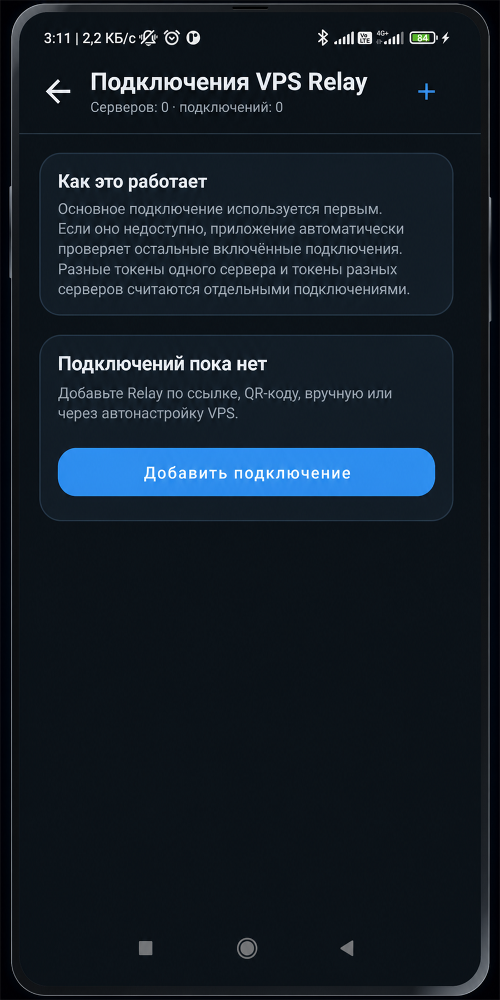
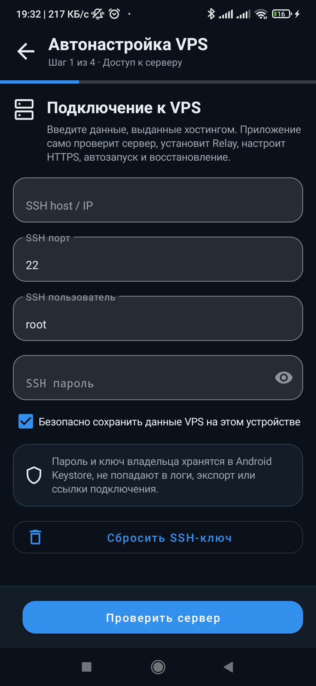

# VPS Relay в TG Proxy Android

VPS Relay - личный серверный маршрут для TG Proxy. Серверная реализация и релизы находятся в отдельном репозитории: [Dushnyj/TG-Proxy-Relay](https://github.com/Dushnyj/TG-Proxy-Relay).

```text
TG Proxy Android -> wss://relay.example.com/apiws -> tgproxy-relay -> TCP Telegram DC:443
```

## Когда нужен VPS Relay

- мобильный оператор режет прямой Telegram/WebSocket;
- публичный Cloudflare-пул нестабилен или получает `HTTP 429`;
- нужен свой контролируемый маршрут без передачи SSH-доступа другим пользователям;
- нужно привязать разные Relay к разным сетевым профилям.

Перед созданием сервера проверьте
[требования к VPS](https://github.com/Dushnyj/TG-Proxy-Relay/blob/main/docs/VPS_REQUIREMENTS.md).

<p align="center">
  
</p>

## Подключения и ручной ввод

Откройте **Настройки → Relay → Подключения VPS Relay**. Здесь серверы сгруппированы отдельно
от клиентских токенов: два токена одного Relay находятся в одной группе, а независимые VPS —
в разных. Для текущего сетевого профиля у каждого подключения явно показано состояние
`Основное`, `Резерв` или `Отключено`.

Для ручного добавления нажмите **Добавить подключение → Ввести вручную**:

```text
Название        Home VPS
Host / IP       relay.example.com
Port            443
TLS             включено
Path            /apiws
Token           token, выданный владельцем Relay
```

Нажмите `Проверить и сохранить`. Android проверит `/healthz`, `/version`, `/capabilities`, TCP-only matrix
`/test-routes`, затем самостоятельно выполнит настоящий Telegram `req_pq/resPQ` по main/media
маршрутам. Один HTTP/TCP/WebSocket handshake не считается доказательством работы Telegram.
Результат показывается коротким пользовательским сообщением; исходная техническая причина
остаётся в диагностическом логе.

Карточка сохранённого подключения позволяет отдельно проверить, передать, сделать основным,
включить как резерв, отключить только в текущем профиле, изменить или удалить его с телефона.
Удаление локальной карточки не отзывает токен на VPS — отзыв выполняется только владельцем.

Можно одновременно включить несколько токенов одного Relay и несколько независимых VPS.
Основное подключение имеет первый приоритет, остальные образуют упорядоченный резерв текущего
профиля. У каждого Relay отдельные cooldown и статистика отказов; недоступность первого не
блокирует попытку второго. Переключение выполняется для нового MTProto-соединения — уже
оборванный поток Telegram нельзя безопасно перенести между серверами посередине передачи.

## Автонастройка VPS

Автонастройка выполняется по SSH и работает с Relay release assets из `Dushnyj/TG-Proxy-Relay`.
TG Proxy Android `1.3.0` устанавливает совместимую серверную версию `TG Proxy VPS Relay 1.3.0`.
При первом SSH-подключении приложение показывает тип ключа и `SHA256:` fingerprint. Сверьте fingerprint с консолью/панелью VPS и явно подтвердите его — молчаливого принятия первого ключа нет. После этого приложение сохраняет host key VPS в своём приватном хранилище. Последующие подключения принимаются только с тем же ключом. После подтверждённой переустановки VPS старый ключ можно удалить кнопкой `Сбросить SSH-ключ` в диалоге автонастройки.

<p align="center">
  
</p>

Полноэкранный мастер просит только SSH IP/логин/пароль, проверяет ключ сервера и затем предлагает
три понятных варианта публичного адреса:

1. `Без домена` — публичный IP VPS, HTTPS на `443`, короткоживущий IP-сертификат Let's Encrypt;
2. `DuckDNS` — пользователь создаёт бесплатное имя на `duckdns.org`, вводит имя и token,
   приложение обновляет DNS и сохраняет token только в зашифрованном хранилище владельца;
3. `У меня есть домен` — можно вручную ввести любой принадлежащий пользователю домен или
   поддомен. Он не обязан быть DuckDNS и не обязан уже присутствовать в конфигурациях VPS;
   приложение лишь проверяет, что его A/AAAA-запись указывает на публичный IP выбранного VPS.
   Найденные на сервере домены показываются отдельным компактным списком только как подсказки.

Во всех трёх вариантах приложение само устанавливает недостающие системные пакеты, nginx,
изолированный Python venv с Certbot, выпускает сертификат HTTP-01 и включает продление через
systemd timer либо cron — в зависимости от init-системы. Для короткоживущего IP-сертификата
используется профиль `shortlived`; проверка продления выполняется каждые 12 часов. Ручная
установка сертификата на сервере не требуется.

Автонастройка не привязана к Ubuntu. Аудит и установщик поддерживают обычные Linux VPS на
Debian/Ubuntu, RHEL/Fedora/Alma/Rocky, openSUSE/SLES, Alpine, Arch, Void и Gentoo-подобных
системах. Определяются `apt`, `dnf`, `microdnf`, `yum`, `zypper`, `apk`, `pacman`, `xbps` и
Portage. Служба Relay создаётся для `systemd`, `OpenRC`, `runit`, `SysV init`; на минимальной
Linux-системе используется переносимый init-скрипт с `@reboot` fallback. Release assets
выбираются по фактической архитектуре VPS, а не по названию дистрибутива.

Перед планом изменений приложение выполняет read-only audit:

- Linux-дистрибутив, архитектура, init-система и пакетный менеджер;
- nginx/apache/caddy/docker;
- занятые порты;
- DNS домена и публичный IP VPS;
- существующие сертификаты Let's Encrypt и возможность безопасно выпустить новый;
- уже установленный `/etc/tgproxy-relay/config.json`;
- домены из nginx, apache, caddy, docker-compose и `/etc/letsencrypt/live`.

## Безопасное встраивание в домен

Автонастройка не должна ломать существующий сайт.
Она может встроиться только в понятный и проверенный вариант:

- один найденный nginx `server` block для домена;
- один валидный host Caddyfile;
- один валидный Docker Caddy stack с доступным Caddy container.

Перед изменениями создаётся backup `/etc/tgproxy-relay`, systemd/OpenRC/runit/SysV-конфигурации
службы, заданий cron и web-конфигов. Backup имеет уникальный transaction id, и rollback может
восстановить только эту же транзакцию — параллельная настройка другого Relay не подменит точку
отката.
На чистом VPS отсутствие nginx и сертификата является нормальным случаем: мастер установит их
сам. Остановка происходит только при проверяемом конфликте — например, path уже занят, домен
указывает на другой VPS, `80/443` занят неизвестным сервисом или существующий web stack нельзя
изменить изолированно. Причина показывается до применения плана.

До первой удалённой операции приложение обязано записать SSH endpoint, admin token и, если
включён переключатель, SSH-пароль в защищённое Android Keystore-хранилище. Эти данные остаются
после обновления APK той же подписью, но не входят в Android backup и не экспортируются.

## Владелец Relay

Owner-панель доступна только на устройстве, где сохранён admin token после создания Relay или
ввода данных сервера. Наличие обычной ссылки подключения или client token не даёт прав
владельца. Владелец может:

- видеть все client tokens без восстановления их необратимо утраченных raw secrets;
- создать именованный client token и сразу сохранить его secret на своём устройстве;
- отозвать token и закрыть все его активные WebSocket-сессии;
- открыть список известных устройств этого token: производитель, модель, версии TG Proxy и
  Android, первая/последняя активность, число сессий и GeoIP-страна/город;
- отключить текущие сессии одного устройства без отзыва token;
- заблокировать или разблокировать устройство. Блокировка применяется до открытия upstream и
  не даёт этому installation ID снова использовать token, но не затрагивает другие устройства.

В Relay 1.3.0 создание токена идемпотентно. До запроса Android шифрованно сохраняет черновик
secret и request ID. Если сеть оборвалась после создания токена, повтор возвращает тот же
token/secret вместо добавления дубликата. Черновик удаляется только после локального сохранения
или подтверждённого server-side rollback.

Начиная с Android 1.3.0 устройство передаёт раздельные manufacturer, brand, raw model и
нормализованное коммерческое название. Стабильный псевдонимный identity v2 прекращает создание
новых дублей после обновления/переустановки той же подписанной сборки; прежний локальный ID
передаётся как узкий migration alias, чтобы сохранить историю и блокировку.

Если один VPS опубликован через несколько подтверждённых адресов, приложение сохраняет owner-
доступ для каждого адреса и не переносит его разрушительно на последний созданный профиль.
Повторная автонастройка того же SSH endpoint предлагает использовать уже сохранённый client
token либо создать отдельный новый token. SSH identity включает host, port и пользователя.

Местоположение является приблизительным GeoIP по публичному адресу (`Россия, г. Москва`), а
не GPS. Если внешний GeoIP выключен или недоступен, сервер оставляет IP без города/страны.

## Передача, импорт и резервная копия

Безопасный экспорт подключения не содержит SSH-данные и не содержит raw MTProto secret.
В карточке конкретного подключения нажмите **Поделиться**: единый список позволяет скопировать
кликабельную ссылку, показать QR, отправить сам QR как PNG, открыть системное меню Android или
отправить `.tgproxy`-файл. Передаётся только один выбранный client token; SSH, owner token,
DuckDNS token и остальные подключения VPS не включаются.

Основной формат — `https://<relay>/<path>/connect#data=b64_...`. Он кликабелен в Telegram и
других чатах. Payload после `#` не отправляется HTTP-серверу; landing page открывает
`tgproxy://import`. Внешняя ссылка и QR никогда не применяются сразу: приложение показывает
окно `Добавить новое подключение VPS Relay`, endpoint и область применения, затем просит
подтверждение. Несколько профилей одного endpoint могут хранить независимые client tokens.

Добавить подключение можно тем же единым меню: автонастройкой своего VPS, вставкой ссылки или
текста, открытием `.tgproxy`, сканированием QR либо ручным вводом. Android также принимает
переданные из других приложений текст, файл и QR-изображение. Любой внешний payload
обрабатывается один раз, показывает preview и сохраняется только после проверки Relay.

Общий экспорт настроек и зашифрованная полная резервная копия находятся в
**Настройки → Система → Резервная копия и восстановление**. Это не замена кнопке
**Поделиться**: резервная копия предназначена владельцу устройства, а share — получателю
одного клиентского подключения.

Пошаговые сценарии с обезличенными экранами вынесены в
[SHARING_AND_IMPORT.md](SHARING_AND_IMPORT.md).

`Path` является частью серверной конфигурации (`websocket.path`) и должен совпадать на Android,
Relay и reverse proxy. Допустим абсолютный путь без query/fragment; `/healthz`, `/version`,
`/capabilities` и `/test-routes` зарезервированы.

На новом экране ручное добавление и импорт всегда выполняют сетевую проверку до сохранения.
Для уже сохранённой карточки кнопка **Проверить подключение** обновляет capability и stable
instance snapshot, но не зависит от того, добавлен ли локальный proxy в Telegram. Чтобы сам
Telegram использовал приложение, в нём по-прежнему должен быть включён локальный
`127.0.0.1:1443`.

## Topology и новые DC

Relay 1.3.0 сообщает Android реально поддерживаемые DC, protocol/features и topology revision
через `/capabilities`. Сервер может использовать несколько endpoints на один DC, роли
`regular/media/cdn/static`, IPv4/IPv6 и произвольный port. При настроенном подписанном update
source неизвестный DC запускает rate-limited refresh; новая таблица применяется только после
Ed25519-проверки и остаётся доступной как atomic last-known-good.

Android обновляет сохранённый capability snapshot при проверке Relay и при фоновой проверке
версии после открытия приложения. Поэтому статическая серверная карта, обновлённая владельцем,
не требует нового APK; dynamic Relay дополнительно принимает будущий DC сразу и выполняет
ограниченный on-demand refresh подписанной topology.

Relay без `/capabilities` остаётся совместимым как legacy static-map сервер, но Android не
создаёт для него ложный кандидат неизвестного DC. Настройка signed topology описана в серверном
документе `docs/TOPOLOGY.md` репозитория Relay.

## Обновление Relay

Если приложение видит, что серверная версия ниже совместимой, оно предлагает `Обновить` или `Пропустить`.
Кнопка обновления предназначена для пользователя, у которого есть SSH-доступ к VPS. Пользователь с импортированным токеном должен сообщить владельцу Relay.
